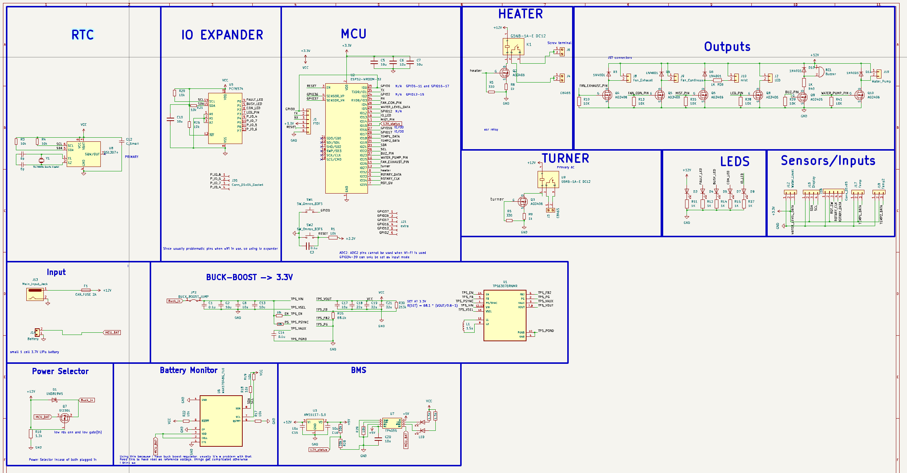
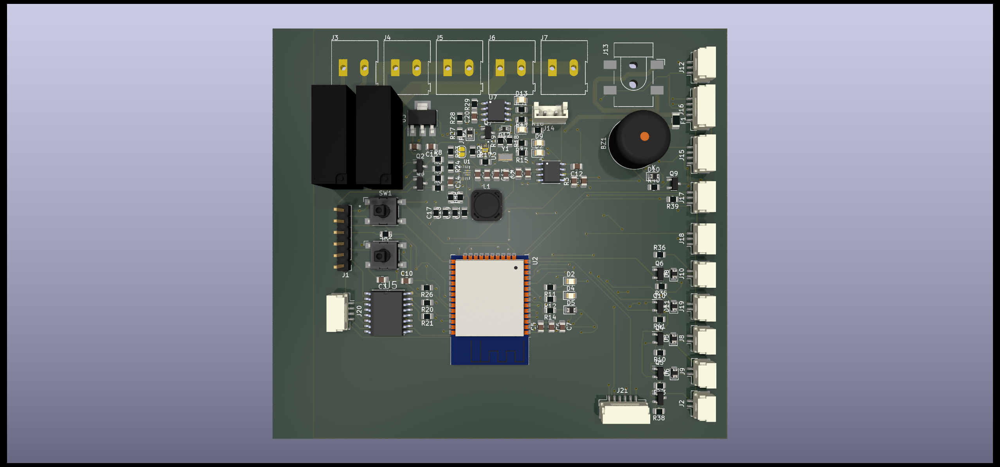

# V1.0 -> First tentative version with following features: 
made with Kicad, 2 layers, lots of vias :D 
- battery monitoring
- battery charge/discharge maintanance LIPO 
- buck boost regulator TPS 
- Source selector that can select between mcu_bat or +12V automatically
- An RTC that can keep time even without battery. helpful for critical memory and notifications. 
- An optional IO expander (PCF) providing 8 extra GPIO. can be left unpopulated. pcb should work fine. 
- MCU used is ESP32 with bluetooth and wifi hopefully both being utillized
- Heater and egg turner both AC, egg turner is the continous type and is the only type currently supported. 
- Main Voltage being used is +12V provided by jack, that will power fans, logic board. incase of power outage heavy stuff will be turned off automatically and it will go into power saving mode. 
- Outputs (All 12V)
    - Fan Exhaust 
    - Fan Continous 
    - Mist Maker 
    - LED lights 
    - Buzzer
    - Water Pump 
- Sensors/Inputs
    - Water level sensor
    - Display (I2C)
    - Rotary encoder for menu (left, right and click)
    - Temperature sensor (1 wire or digital)
    - Temperature sensor #2 (1 wire or digital)
- Indicators
    - Fault led, will light up if something is wrong according to code
    - Busy led, will turn on when turning eggs or saving to memory 
    - Con led, shows connectivity of wifi, if connected will light up
    - IO led, custom function or initial testing. 
    - Main power indicator led that will light up when 12V is connected through barrel jack. 

This is how it looks as of right now. 

PCB 

